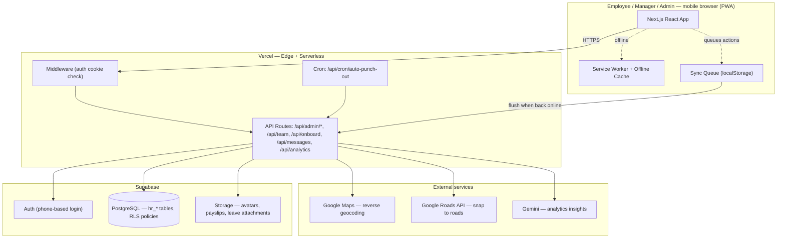

# Field Connect

A white-label, mobile-first PWA for field workforce HR — GPS-verified punch in/out, live team tracking, leave management, payroll, and admin analytics, all running from a phone browser with offline support.

## Overview

Field Connect is the white-label version of the UDS HR system. It was cloned into its own repository, Supabase project, and Vercel deployment so it can be resold/rebranded to other companies without touching the production UDS HR codebase or database.

The product is built for organizations with field employees (sales reps, service technicians, site staff) who need to record attendance and location from their phones — often with unreliable connectivity — without installing a native app. The UI still uses the underlying `project_id` field from the original schema, but relabels it as **Companies**, letting a single deployment serve multiple client organizations with separate leave policies, departments, and designations.

**Live app:** https://field-connect.vercel.app

## Key Features

- **Punch in/out attendance** with GPS location capture, reverse geocoding (Google Maps), and an offline sync queue so punches recorded without a connection are flushed automatically once online
- **Live team tracking** on a Leaflet map, with scheduled background GPS capture at fixed times during the day and road-snapping via the Google Roads API
- **Leave management** — leave requests, balances, configurable leave types/policies (including WFH), and manager/admin approval workflows
- **Attendance rectification requests** for employees to flag and correct missed or incorrect punches
- **Employee onboarding** via one-time self-service onboarding token links
- **Payroll** — salary components, payroll runs, and downloadable PDF payslips (via `jspdf`)
- **Admin reports & analytics**, including AI-generated insights (Gemini)
- **Bulk employee upload wizard** for onboarding large teams from a spreadsheet
- **HR inbox / messaging** between employees and HR
- **Organisation management** — companies, departments, designations, and leave policies as master data
- **Role-based access control**: `employee`, `manager`, `admin`, `super_admin`, with HR designation granting universal access
- **Installable PWA**: custom service worker with offline fallback page and cache-first/network-first strategy
- **Scheduled auto punch-out** via a daily Vercel Cron job for employees who forget to punch out

## Tech Stack

| Layer | Technology |
|-------|-----------|
| Frontend | Next.js 14 (App Router), React 18, TypeScript, Tailwind CSS |
| Backend | Next.js API routes (serverless functions on Vercel) |
| Database / Auth / Storage | Supabase (PostgreSQL + Auth + Storage), row-level security |
| Maps | Leaflet / react-leaflet v4, Google Maps Geocoding + Roads APIs |
| AI | Google Gemini (analytics insights) |
| PWA | Custom service worker, offline sync queue, install prompt |
| PDF generation | jspdf (payslips) |
| Icons / dates | lucide-react, date-fns |
| Hosting | Vercel, auto-deploy from `main`, scheduled Cron |
| E2E testing | Playwright (installed, no scripts/config configured yet) |

## Architecture



## Project Structure

```
field-connect/
├── src/
│   ├── app/                  # Next.js App Router pages ("use client" dashboard pages)
│   │   ├── api/              # Server route handlers (admin, analytics, onboarding, cron)
│   │   ├── dashboard/        # Authenticated app: attendance, leave, team, reports, payroll...
│   │   ├── login/, onboard/  # Public pages
│   ├── components/           # Feature-organized UI: punch, attendance, leave, team, tracking...
│   ├── hooks/                # usePunchState, useGeolocation, useOnlineStatus, useSyncQueue...
│   └── lib/                  # Data layer (*-api.ts), auth context, Supabase clients, utils
├── supabase/migrations/       # 23+ SQL migrations defining the hr_* schema
├── docs/                      # Full documentation set (see below)
├── stitch/                    # Reference design screens (source of truth for UI)
└── public/                    # PWA manifest, service worker, icons
```

## Setup & Installation

Prerequisites: Node.js 18+, npm, and a Supabase project with the `hr_*` schema (see [docs/DATABASE.md](docs/DATABASE.md)).

```bash
# Clone the repository
git clone https://github.com/srksourabh/field-connect.git
cd field-connect

# Install dependencies
npm install

# Create your environment file
cp .env.example .env.local
```

Fill in `.env.local`:

```env
NEXT_PUBLIC_SUPABASE_URL=https://your-project.supabase.co
NEXT_PUBLIC_SUPABASE_ANON_KEY=your-anon-key
SUPABASE_SERVICE_ROLE_KEY=your-service-role-key
NEXT_PUBLIC_GOOGLE_MAPS_API_KEY=your-google-maps-api-key
NEXT_PUBLIC_GEMINI_API_KEY=your-gemini-api-key
CRON_SECRET=your-random-cron-secret
```

```bash
# Start the dev server
npm run dev
```

The app runs at `http://localhost:3000`.

## Usage

```bash
npm run dev      # Start dev server (localhost:3000)
npm run build    # Production build — also used as a verification step
npm run start    # Start production server
npm run lint      # ESLint check
```

Sign in on `/login` with a phone number and password (auth uses `${phone}@fieldconnect.local` internally). A demo admin login is also available for quickly exploring the admin dashboard. From there:

- Employees punch in/out, apply for leave, and view payslips from the dashboard
- Managers/Admins manage their team, approve leave and rectification requests, and view live location tracking from **Dashboard → Team**
- Admins manage companies, departments, designations, and leave policies from **Dashboard → Manage Organisation**, and payroll from **Dashboard → Payroll**
- Super Admins have unrestricted access across all companies

For a full role-by-role walkthrough, see [docs/USER_GUIDE.md](docs/USER_GUIDE.md).

## Documentation

This repo includes a full documentation set in [`docs/`](docs/):

| Document | Description |
|----------|------------|
| [ARCHITECTURE.md](docs/ARCHITECTURE.md) | System design, directory layout, key patterns, data flows, deployment |
| [DATABASE.md](docs/DATABASE.md) | All tables, columns, RLS policies, functions, storage buckets |
| [API_REFERENCE.md](docs/API_REFERENCE.md) | Every API route with methods, auth, request/response shapes |
| [FUNCTIONS.md](docs/FUNCTIONS.md) | All exported functions and hooks with signatures and descriptions |
| [USER_GUIDE.md](docs/USER_GUIDE.md) | End-user guide organized by role (Employee, Manager, Admin, Super Admin) |
| [SECURITY.md](docs/SECURITY.md) | Authentication, authorization, RLS, security headers, data protection |

## Screenshot


More screenshots covering every screen (login, attendance calendar, leave, team tracking map, admin, payroll, analytics, and more) are in [`docs/screenshots/`](docs/screenshots/).

## Production Isolation

Field Connect intentionally does not share a Supabase project, Vercel project, or environment variables with the production UDS HR system (`srksourabh/uds-hr`). Keep it that way when making changes.
