# Field Connect User Guide

A step-by-step guide with screenshots for every feature. Field Connect is a mobile-first web app for field workforce HR management — punch in/out, attendance, leave, live GPS tracking, and team management.

**App URL:** https://Field Connect.vercel.app

---

## Table of Contents

1. [Getting Started](#1-getting-started)
2. [Dashboard (Home Screen)](#2-dashboard-home-screen)
3. [Attendance](#3-attendance)
4. [Leave Management](#4-leave-management)
5. [Profile & Settings](#5-profile--settings)
6. [Team Organogram](#6-team-organogram)
7. [Team Tracking (Manager+)](#7-team-tracking-manager)
8. [Approvals (Manager+)](#8-approvals-manager)
9. [Reports (Manager+)](#9-reports-manager)
10. [Analytics (Manager+)](#10-analytics-manager)
11. [Employee Management (Admin+)](#11-employee-management-admin)
12. [Add Employee (Admin+)](#12-add-employee-admin)
13. [Leave Allotment (Admin+)](#13-leave-allotment-admin)
14. [Admin Map (Admin+)](#14-admin-map-admin)
15. [Onboarding (Admin+)](#15-onboarding-admin)
16. [Organisation Hub (Super Admin / HR)](#16-organisation-hub-super-admin--hr)
17. [Broadcast Notifications (Super Admin / HR)](#17-broadcast-notifications-super-admin--hr)
18. [Master Data Management (Super Admin / HR)](#18-master-data-management-super-admin--hr)
19. [Leave Policies (Super Admin / HR)](#19-leave-policies-super-admin--hr)
20. [HR Inbox (Super Admin / HR)](#20-hr-inbox-super-admin--hr)
21. [My Projects](#21-my-projects)
22. [Message HR](#22-message-hr)
23. [Navigation](#23-navigation)
24. [FAQ — Frequently Asked Questions](#24-faq--frequently-asked-questions)
25. [Common Mistakes & Troubleshooting](#25-common-mistakes--troubleshooting)

---

## Role Access Quick Reference

| Feature | Employee | Manager | Admin | Super Admin / HR |
|---------|----------|---------|-------|-----------------|
| Dashboard, Punch, Attendance, Leave, Profile | Yes | Yes | Yes | Yes |
| Team Organogram | Yes (limited) | Yes | Yes | Yes (full) |
| Team Tracking Map | No | Yes | Yes | Yes |
| Approvals (Leave & Rectification) | No | Yes | Yes | Yes |
| Reports & Analytics | No | Yes | Yes | Yes |
| Employee Management | No | No | Yes (own project) | Yes (all projects) |
| Leave Allotment | No | No | Yes | Yes |
| Onboarding | No | No | Yes | Yes |
| Organisation, Notifications, Policies, HR Inbox | No | No | No | Yes |

---

## 1. Getting Started

### 1.1 Opening the App

Open your phone browser and go to **https://Field Connect.vercel.app**

You'll see the landing page:

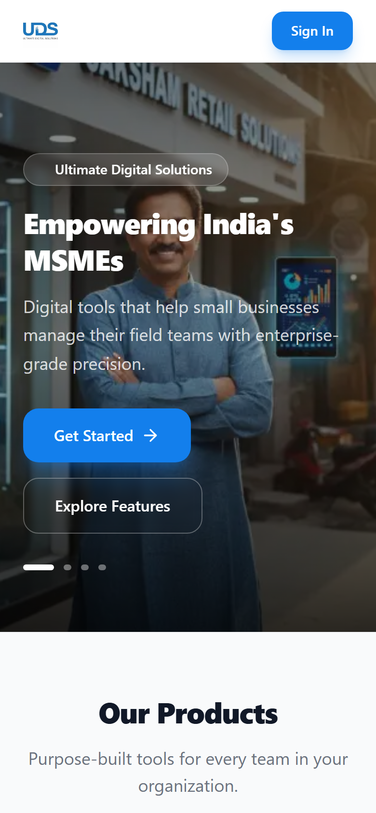

Tap **"Login"** at the top right to go to the login screen.

### 1.2 Logging In

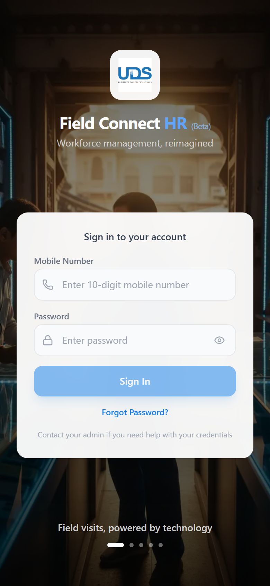

**Step-by-step:**

1. Enter your **10-digit phone number** (no country code, no spaces).
2. Enter your **password**.
3. Tap **"Sign In"**.

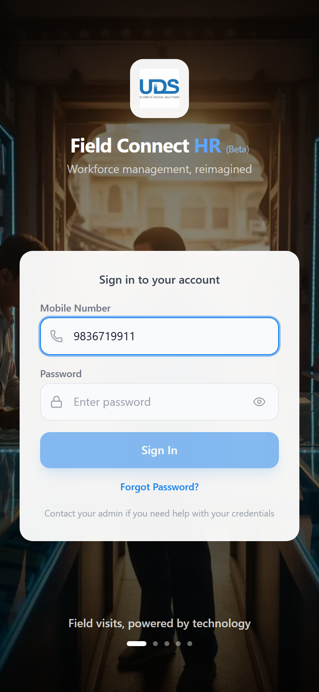

**Your default password** is: first 4 letters of your name (lowercase, no spaces) + last 4 digits of your phone number.

> **Example:** Name = "Sourabh Bhaumik", Phone = "9836719911"
> Password = `sour9911`

### 1.3 Forgot Password

If you forget your password:

1. On the login screen, tap **"Forgot Password?"**
2. Enter your phone number and tap **"Find Account"**.
3. The system shows a masked version of your personal email (e.g., `so***bh@gm***il.com`).
4. Enter the **full email** to verify your identity.
5. Your password resets to the default format. Log in with the default password.

> **Note:** If you don't have a personal email on file, ask your admin to reset your password.

### 1.4 Installing as an App (PWA)

For the best experience, install Field Connect as an app on your phone:

- **Android (Chrome):** A banner will appear at the bottom saying "Add to Home Screen" — tap it.
- **iPhone (Safari):** Tap the Share button (square with arrow) → tap "Add to Home Screen."

Once installed, Field Connect opens full-screen like a native app and works even with poor connectivity.

### 1.5 Single-Device Rule

Field Connect allows **one active login at a time**. If you log in on a new device, your previous session is automatically ended. This is by design for security.

---

## 2. Dashboard (Home Screen)

After login, you arrive at the Dashboard — your main screen for daily attendance.

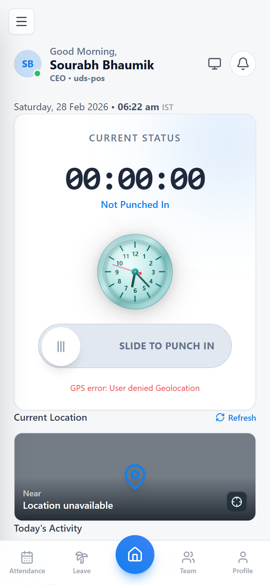

**What you see at the top:**
- Your name, designation, and project
- Live IST clock with an analog clock display
- Theme toggle (light/dark mode)
- Notification bell (tap to see your notifications)

### 2.1 Punching In

1. The **Punch Card** is in the center of the screen.
2. **Slide the button to the right** to punch in.
3. Your phone will request GPS permission — tap **Allow**.
4. The app records your GPS location and starts the timer.

### 2.2 Punching Out

1. While punched in, the card shows your elapsed time.
2. **Slide the button to the left** to punch out.
3. Your GPS location at punch-out is recorded.

> **Tip:** You can punch in and out multiple times a day. Each creates a separate session.

### 2.3 Today's Activity

Scroll down to see your daily activity grid:

- **First In:** When you first punched in today
- **Total Time:** Cumulative hours across all sessions
- **Last Out:** Your most recent punch-out time
- **Distance:** GPS-tracked travel distance (road-snapped)
- **Leave Balance:** Remaining SL/CL/PL days
- **Sessions:** Number of punch in/out cycles today

### 2.4 Route Map & Session Timeline

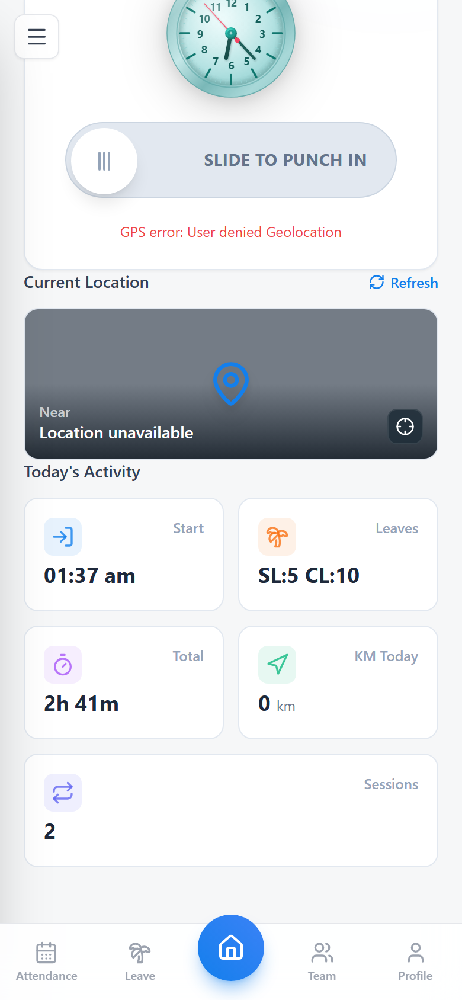

- **Route Map:** Tap to see your GPS trail on a map for today — shows the actual roads you traveled.
- **Session Timeline:** Tap to see all your punch in/out times listed chronologically.
- **HR Policy:** If your company has uploaded a policy document, you can view/download it here.

### 2.5 Offline Mode

If you lose internet connectivity:
- A **yellow banner** appears showing sync status.
- You can still punch in/out — actions are queued locally.
- When connectivity returns, data syncs automatically.
- The number of pending items is shown in the banner.

---

## 3. Attendance

**How to get here:** Tap **"Attendance"** in the bottom navigation bar.

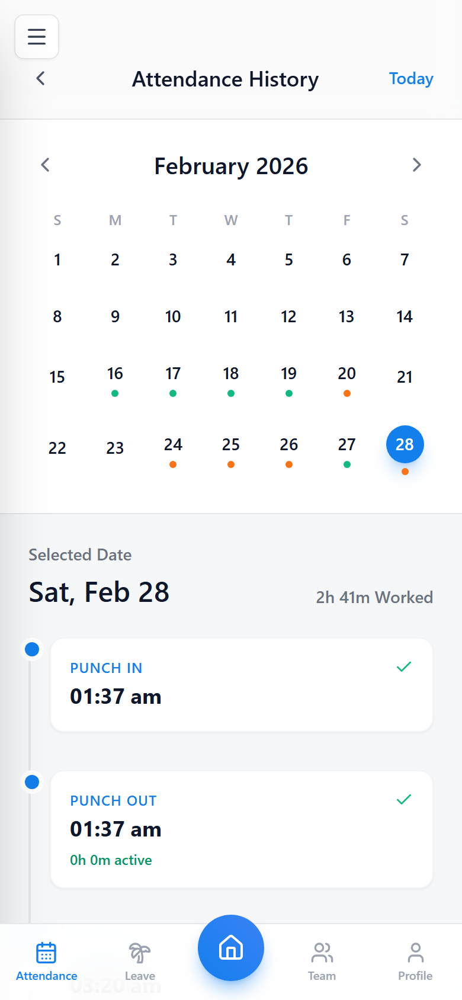

### 3.1 Viewing Your Attendance

The calendar shows your monthly attendance with **color-coded dots**:

| Color | Meaning |
|-------|---------|
| Green | Present |
| Red | Absent |
| Yellow | Half-day |
| Blue | On Leave |
| Orange | Late |

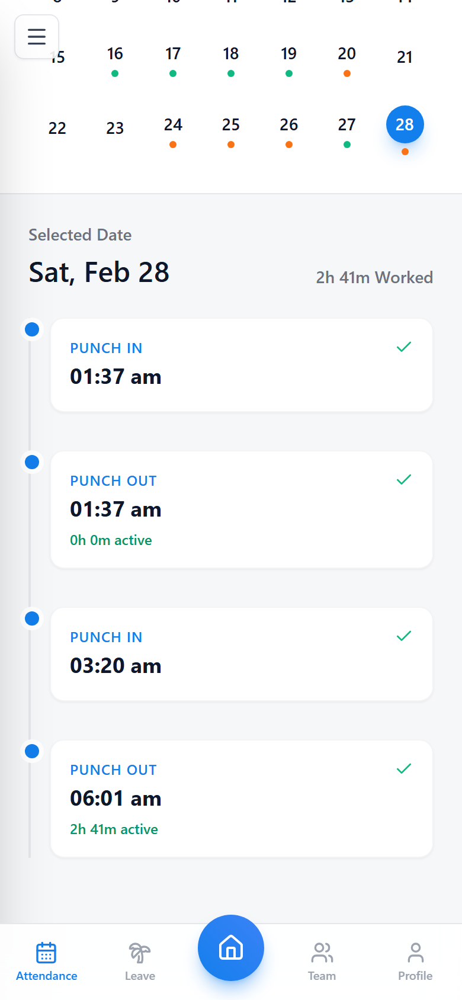

**Step-by-step:**
1. The current month is shown by default.
2. Use the **left/right arrows** to navigate to other months.
3. **Tap any date** to see the day's detail:
   - Status (Present, Absent, etc.)
   - Total hours worked
   - Each punch-in/out session with times
   - If on leave: the leave type is shown (SL, CL, PL)

### 3.2 Requesting a Rectification

If your attendance has an error (missed a punch, wrong time):

**How to get here:** Attendance → Tap a date → "Request Rectification" or go directly to Attendance → Rectification.

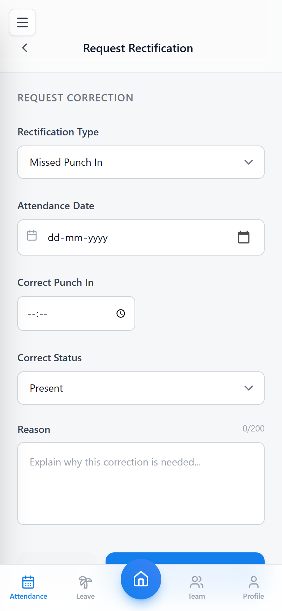

**Step-by-step:**
1. Select **Rectification Type:**
   - Missed Punch-In
   - Missed Punch-Out
   - Wrong Time
   - Other
2. Select the **date** that needs correction.
3. Enter the **corrected punch-in time** and/or **corrected punch-out time**.
4. Select the **corrected status** (Present, Late, Half-Day).
5. Write a **reason** explaining why the correction is needed.
6. Tap **Submit**.

Your manager receives a notification and can approve or reject the request.

---

## 4. Leave Management

**How to get here:** Tap **"Leave"** in the bottom navigation bar.

### 4.1 Checking Your Leave Balance

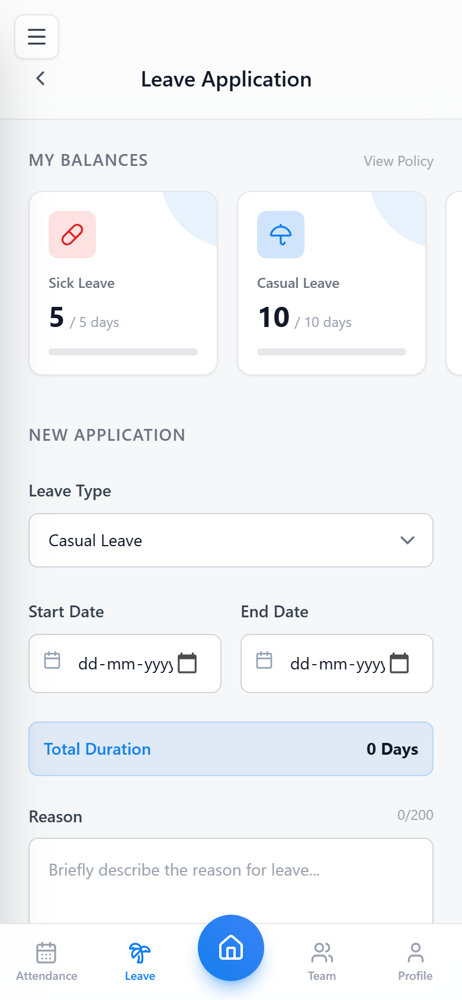

At the top, you see cards for each leave type:
- **SL (Sick Leave):** Remaining / Total
- **CL (Casual Leave):** Remaining / Total
- **PL (Privilege Leave):** Remaining / Total
- **Comp-Off:** Remaining / Total

### 4.2 Applying for Leave

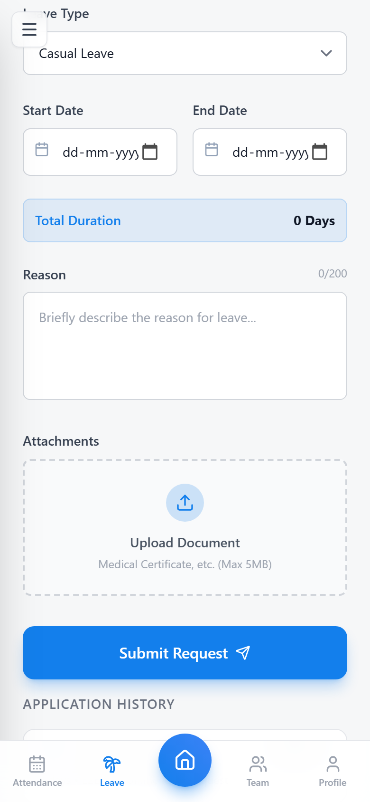

**Step-by-step:**
1. Scroll down to the **"Apply for Leave"** section.
2. Select the **leave type** (Sick, Casual, Privilege, Comp-Off).
3. Pick the **start date** and **end date**.
4. Write a **reason** for the leave.
5. Optionally tap **"Attach File"** to upload a document (e.g., medical certificate).
6. Tap **"Apply"**.

The system checks:
- You have enough balance for the requested days.
- No overlapping leave requests exist for those dates.
- Your manager is notified automatically.

### 4.3 Leave History & Withdrawing

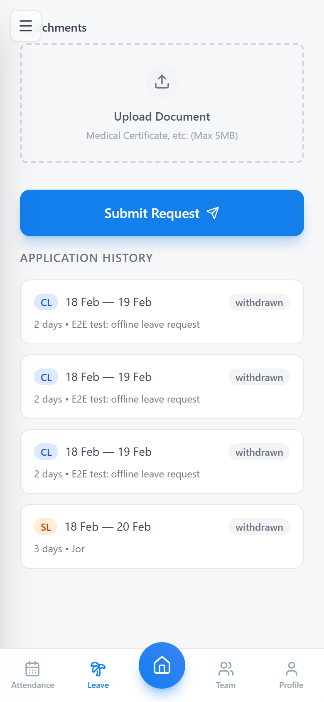

Scroll to the bottom to see all your leave requests:
- **Pending** — Waiting for manager approval. You can tap **"Withdraw"** to cancel.
- **Approved** — Leave was granted.
- **Rejected** — Leave was denied (may show a comment from manager).
- **Withdrawn** — You cancelled the request.

---

## 5. Profile & Settings

**How to get here:** Tap **"Profile"** in the bottom navigation bar.

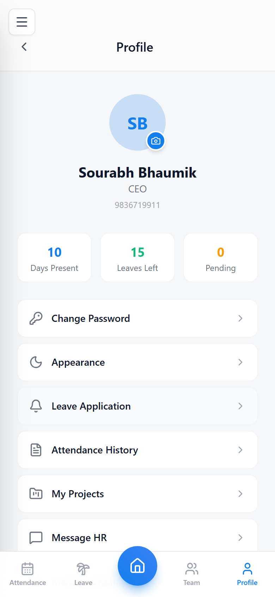

### 5.1 Profile Photo

1. Tap the **camera icon** on your avatar.
2. Select a photo from your phone (max 5 MB).
3. The photo uploads automatically.

### 5.2 Quick Stats

Below your name, you see:
- **Days Present** this month
- **Leaves Left** (total remaining)
- **Pending Requests**

### 5.3 Settings Menu

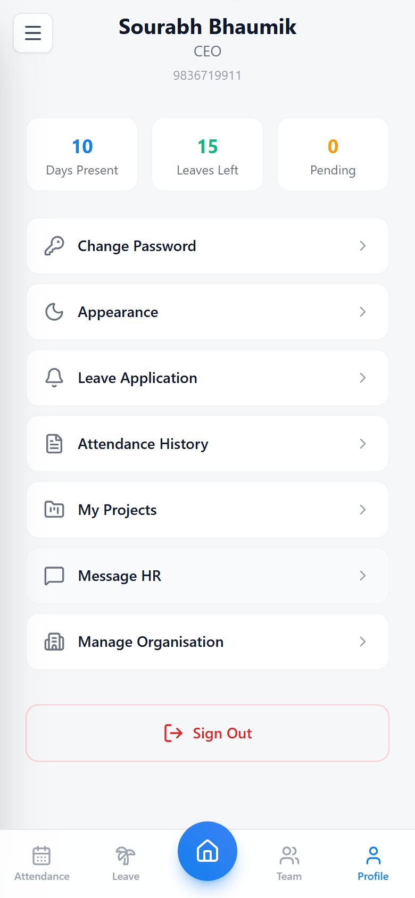

Scroll down for these options:

- **Change Password:**
  1. Tap "Change Password."
  2. Enter your **current password**.
  3. Enter a **new password** (at least 6 characters).
  4. Tap **"Update Password"**.

- **Appearance:** Switch between Light, Dark, or System theme.

- **Leave Application:** Quick link to the leave form.

- **Attendance History:** Quick link to the attendance calendar.

- **My Projects:** View your assigned project(s).

- **Message HR:** Send anonymous feedback to HR.

- **Manage Organisation:** *(Only visible to Super Admin / HR)* — Opens the Organisation Hub.

- **Sign Out:** Logs you out and returns to the login screen.

---

## 6. Team Organogram

**How to get here:** Sidebar → Team, or via the Team icon.

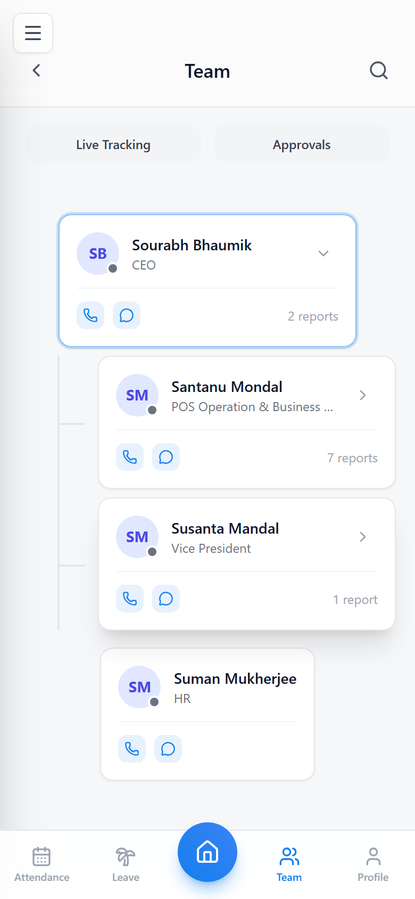

### What You See

An interactive organization chart showing your team:
- **Employees** see their peers (same manager) and everyone below them.
- **Managers** see their direct reports and below.
- **Admins** see their entire project.
- **Super Admin / HR** see the complete organization across all projects.

**Step-by-step:**
1. The chart loads automatically with your visible team.
2. Use the **search bar** to find someone by name or designation.
3. **Tap any person** to open their detail card showing:
   - Name, designation, department
   - Phone number
   - Location status (online/away/offline)
4. Scroll horizontally to see wider team structures.

**Status indicators:**
- **Green dot** = Online (GPS log within 15 minutes)
- **Yellow dot** = Away (punched in but no recent GPS)
- **Grey dot** = Offline (not punched in)

---

## 7. Team Tracking (Manager+)

**Who can access:** Manager, Admin, Super Admin

**How to get here:** Team → Live Tracking.

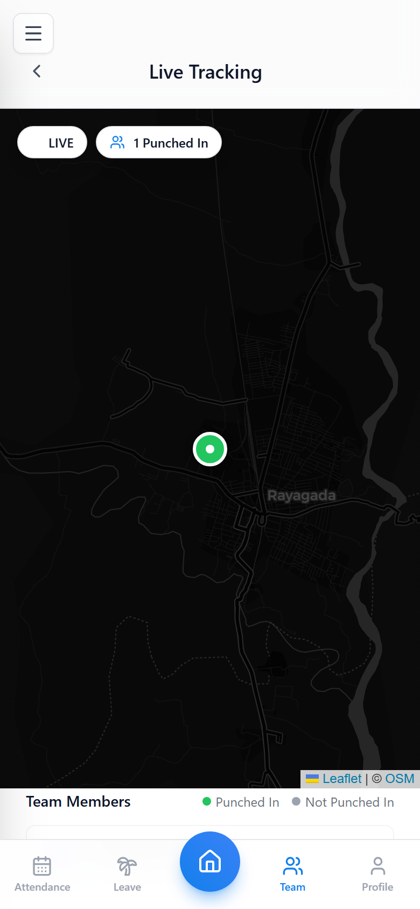

### Viewing Your Team on the Map

**Step-by-step:**
1. The map shows markers for each team member's last known GPS location.
2. **Green markers** = currently punched in.
3. **Grey markers** = not punched in.
4. **Tap a marker** to see the employee's name, designation, and last-seen time.
5. The **employee list** at the bottom shows everyone with their punch-in status and GPS point count.
6. The map **refreshes every 2 minutes** automatically (pauses when you switch tabs).

---

## 8. Approvals (Manager+)

**Who can access:** Manager, Admin, Super Admin

**How to get here:** Team → Approvals.

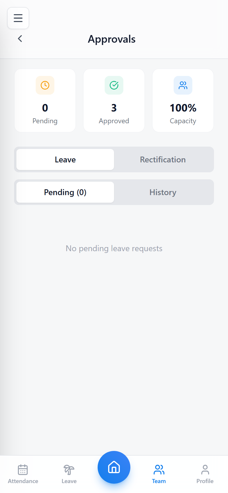

### 8.1 Summary Cards

At the top, you see:
- **Total Pending** requests
- **Total Approved** (this period)
- **Team Capacity** percentage

### 8.2 Approving/Rejecting Leave Requests

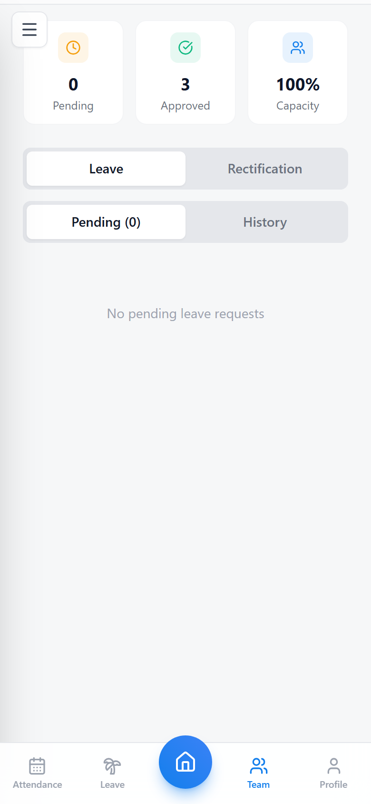

**Step-by-step:**
1. Tap the **"Leave"** tab (default).
2. Each card shows: employee name, leave type, dates, reason, number of days.
3. Tap **"Approve"** to approve the leave.
4. Tap **"Reject"** to deny the leave.
5. A dialog appears where you can **add an optional comment** (e.g., "Approved, enjoy your break" or "Please reschedule — critical deadline").
6. The employee receives a notification with your decision.

### 8.3 Approving/Rejecting Rectification Requests

1. Tap the **"Rectification"** tab.
2. Each card shows: employee name, date, rectification type, original vs corrected times.
3. Tap **"Approve"** or **"Reject"** with an optional comment.
4. On approval, the attendance record is automatically updated.

> **Note:** Switch between **"Pending"** and **"History"** tabs to see past decisions.

---

## 9. Reports (Manager+)

**Who can access:** Manager, Admin, Super Admin

**How to get here:** Sidebar → Reports.

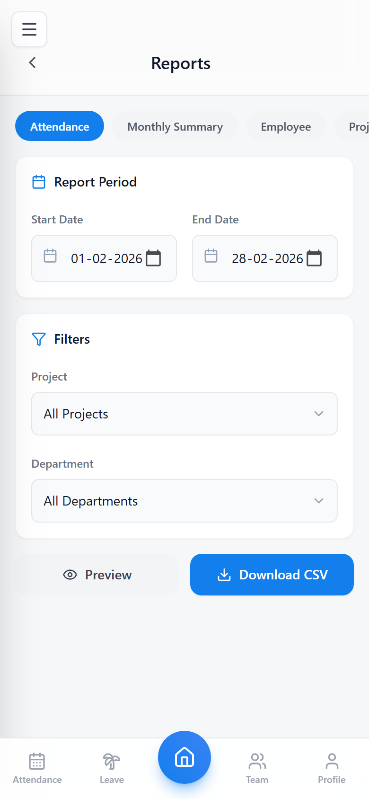

### Generating Reports

**Step-by-step:**

1. Choose a **report type** (tabs at the top):
   - **Attendance:** Daily punch records for a date range.
   - **Monthly Summary:** Totals per employee for a given month.
   - **Employee:** Detailed history for one specific employee.
   - **Project Summary:** Metrics for all employees in a project.

2. Set your **filters:**
   - Date range (or month, depending on report type).
   - Project filter (Admins see only their project; Super Admin/HR see all).
   - Department filter (optional).

3. Tap **"Generate Report"** to preview the data in a table.

4. Tap **"Download CSV"** to save the report as a spreadsheet file.

> **Tip:** The CSV file opens in Excel or Google Sheets for further analysis.

---

## 10. Analytics (Manager+)

**Who can access:** Manager, Admin, Super Admin

**How to get here:** Sidebar → Analytics.

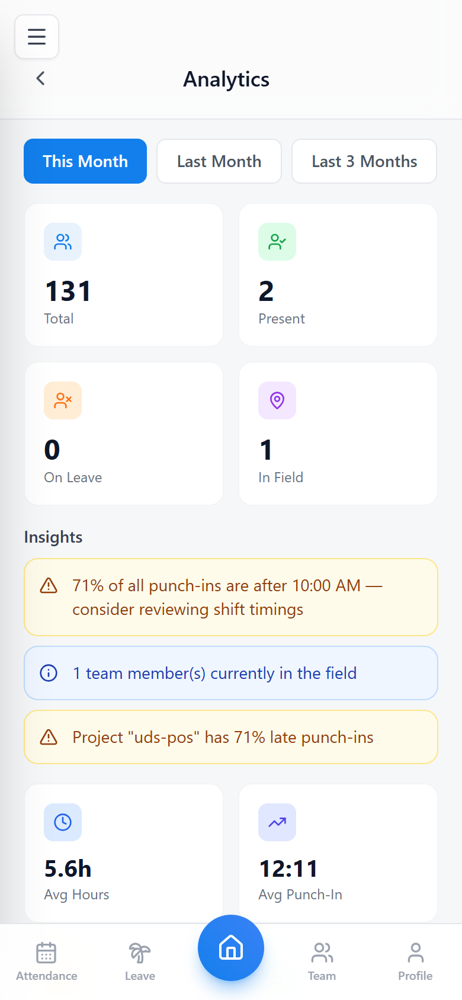

### 10.1 Summary Cards

- **Total Employees** in your scope
- **Present Today** / **Absent Today** / **On Leave Today**
- **In Field Now** (currently punched in)

### 10.2 Key Metrics

- **Avg Hours Worked** per day
- **Avg Punch-In Time**
- **Late Count** (after 10:00 AM)
- **Perfect Attendance** (no absences)

### 10.3 Charts & Trends

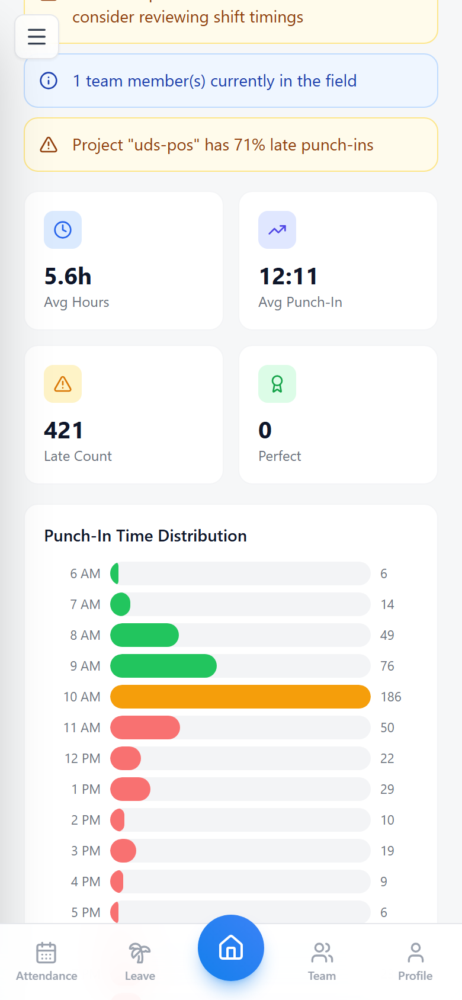

Scroll down to see visual charts:
- **Attendance Trend:** Daily present count over the selected period.
- **Punch-In Distribution:** What time people clock in (hour-by-hour).
- **Day-of-Week Pattern:** Which days have higher/lower attendance.
- **Weekly Comparison:** Week-over-week attendance.

### 10.4 Breakdowns & Insights

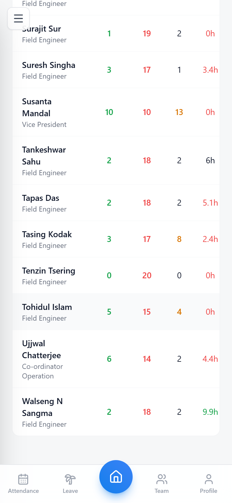

- **Project Breakdown:** Average hours, late percentage, employee count per project.
- **Department Breakdown:** Same metrics per department.
- **Employee Stats Table:** Per-employee: present days, absent days, late days, average hours.
- **AI Insights:** Auto-generated observations (e.g., "5 employees punched in after 10 AM today").

**Period selector:** Use "This Month" / "Last Month" / "Last 3 Months" buttons at the top.

---

## 11. Employee Management (Admin+)

**Who can access:** Admin, Super Admin

**How to get here:** Organisation → Employees, or the Admin page.

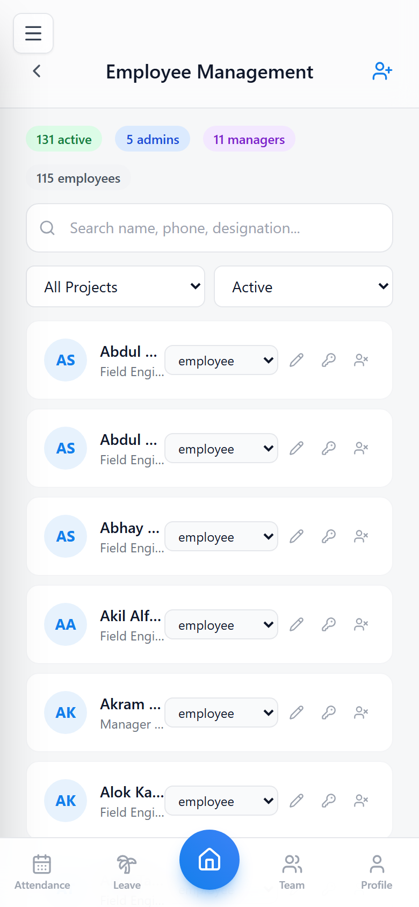

### 11.1 Viewing Employees

- **Search** by name, phone, or designation.
- **Filter** by project (Super Admin/HR see all projects).
- **Filter** by status: Active / Deactivated / All.
- **Count badges** at the top: active, admins, managers, employees.

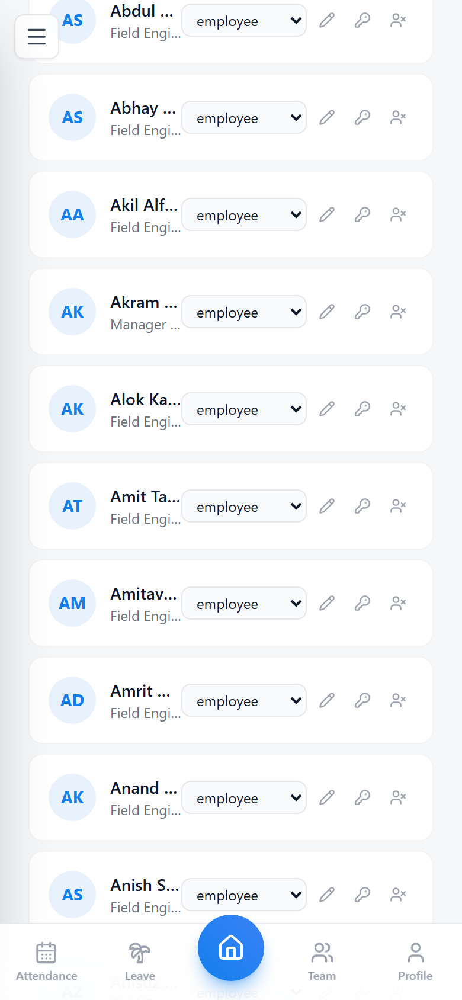

### 11.2 Editing an Employee

**Step-by-step:**
1. Find the employee in the list.
2. Tap the **edit icon** (pencil) on their row.
3. Edit any field: name, phone, designation, department, project, reporting manager.
4. Tap **"Save"** to confirm.

> **Note:** If you change an employee's phone number, their login email is automatically updated to match.

### 11.3 Changing an Employee's Role

1. Tap the **role dropdown** on the employee's row.
2. Select the new role: Employee, Manager.
3. Confirm the change.

> **Note:** Only Super Admins can assign Admin or Super Admin roles.

### 11.4 Resetting a Password

1. Tap the **key icon** on the employee's row.
2. Confirm the reset.
3. The password resets to the default format (first 4 of name + last 4 of phone).
4. All their active sessions are ended.

### 11.5 Deactivating / Restoring

- **Deactivate:** Tap the deactivate button. The employee can't log in anymore. Their data is preserved.
- **Restore:** On a deactivated employee, tap "Restore" to reactivate them.

---

## 12. Add Employee (Admin+)

**Who can access:** Admin, Super Admin

**How to get here:** Organisation → Add Employee.

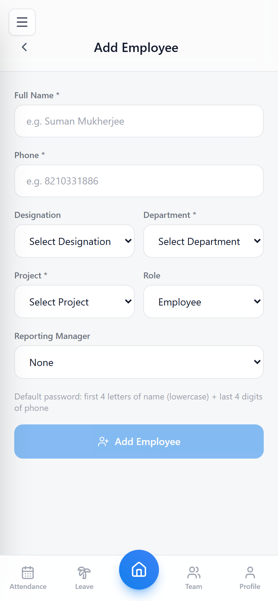

**Step-by-step:**
1. Enter the employee's **full name** (required).
2. Enter their **phone number** (required, 10 digits).
3. Select **designation** from the dropdown.
4. Select **department** (required) from the dropdown.
5. Select **project** (required) from the dropdown.
6. Select **role** (Employee or Manager; Admin only by Super Admin).
7. Optionally select a **reporting manager** from the dropdown.
8. Tap **"Add Employee"**.

**What happens:**
- An account is created with email `{phone}@fieldconnect.local`.
- The default password is: first 4 letters of name + last 4 digits of phone.
- A blank leave balance is created for the current year.
- Share the credentials with the new employee so they can log in.

---

## 13. Leave Allotment (Admin+)

**Who can access:** Admin, Super Admin

**How to get here:** Organisation → Leave Allotment.

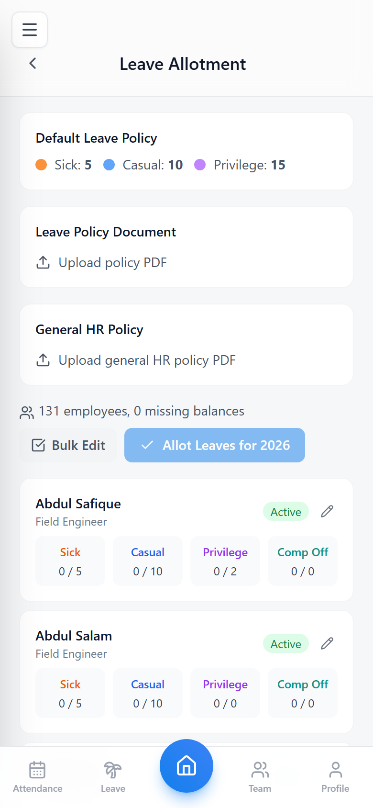

### 13.1 Bulk Allotment

1. Tap **"Allot Leaves"** to create leave balance records for all employees who don't have one for the current year.
2. Set default SL, CL, PL totals.
3. Confirm.

### 13.2 Individual Editing

1. Find an employee in the list.
2. Tap **"Edit"** on their row.
3. Adjust leave totals or used counts.
4. Tap **"Save"**.

> **Note:** Regular admins can only edit Comp-Off fields. Super Admin/HR can edit all leave types (SL, CL, PL, Comp-Off).

### 13.3 Bulk Editing

1. Tap **"Bulk Edit"** at the top.
2. Select multiple employees using checkboxes.
3. Set the values you want to apply.
4. Tap **"Apply to Selected"**.

---

## 14. Admin Map (Admin+)

**Who can access:** Admin, Super Admin

**How to get here:** Organisation → Admin Map, or via sidebar.

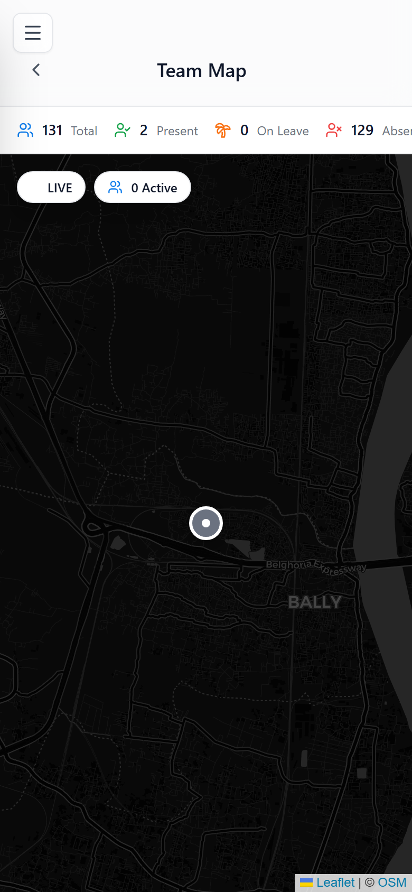

A broader map view showing all employees in your scope:

- **Summary bar** at the top: Total / Present / On Leave / Absent counts.
- **Employee markers** on the map with colored indicators.
- **Tap a marker** to see: name, designation, total hours today, distance traveled, and punch-in time.
- View **GPS trail** per employee.
- Auto-refreshes every 2 minutes.

---

## 15. Onboarding (Admin+)

**Who can access:** Admin, Super Admin

**How to get here:** Organisation → Onboarding.

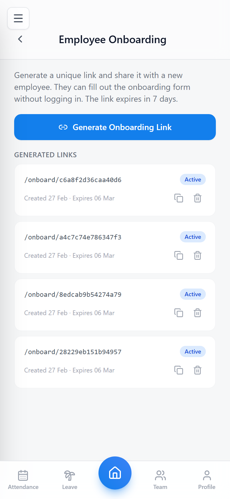

### Generating an Onboarding Link

**Step-by-step:**
1. Tap **"Generate Token"**.
2. A unique link is created (valid for 7 days).
3. Tap **"Copy"** to copy the link to your clipboard.
4. Share the link with the new employee (via WhatsApp, SMS, email, etc.).

### What Happens When Employee Opens the Link

The employee sees a 3-step form:
1. **Personal Info:** Name, email, phone, date of birth, blood group, address.
2. **KYC & Bank:** Aadhaar, PAN, bank details (optional).
3. **Job Info:** Department, project, designation, reporting manager, joining date.

After submission, their account is created automatically with default credentials.

### Managing Tokens

- **Active:** Link is still valid and unused.
- **Used:** An employee already registered with this link.
- **Expired:** The 7-day window has passed.
- Tap the **delete icon** to remove unused tokens.

---

## 16. Organisation Hub (Super Admin / HR)

**Who can access:** Super Admin, HR-designated Admins

**How to get here:** Profile → Manage Organisation.

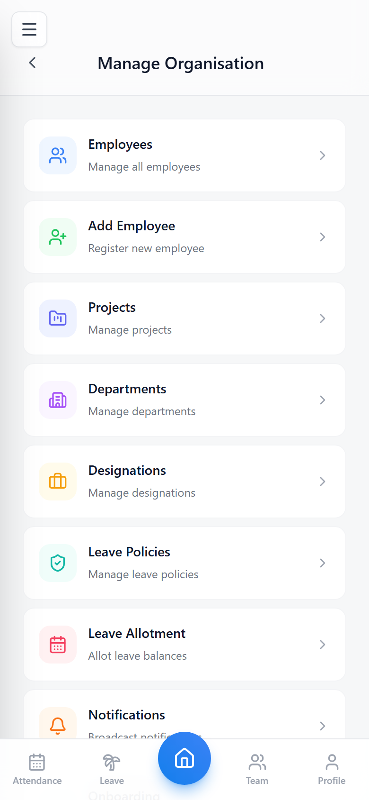

This is the central management hub with navigation tiles:

| Tile | What it does |
|------|-------------|
| Employees | Employee list and management |
| Add Employee | Create a new employee |
| Projects | Manage project master list |
| Departments | Manage department master list |
| Designations | Manage designation master list |
| Leave Policies | Create/edit leave policy templates |
| Leave Allotment | Assign leave balances |
| Notifications | Broadcast announcements |
| Onboarding | Generate registration links |
| Reports | Generate CSV reports |
| HR Inbox | View employee messages |

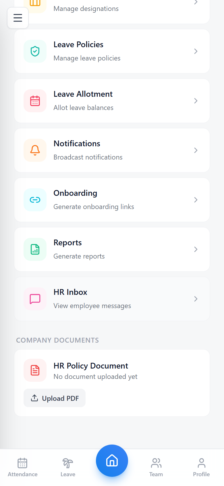

At the bottom: **HR Policy Document** management — upload, view, or remove the company policy PDF.

---

## 17. Broadcast Notifications (Super Admin / HR)

**Who can access:** Super Admin, HR-designated Admins

**How to get here:** Organisation → Notifications.

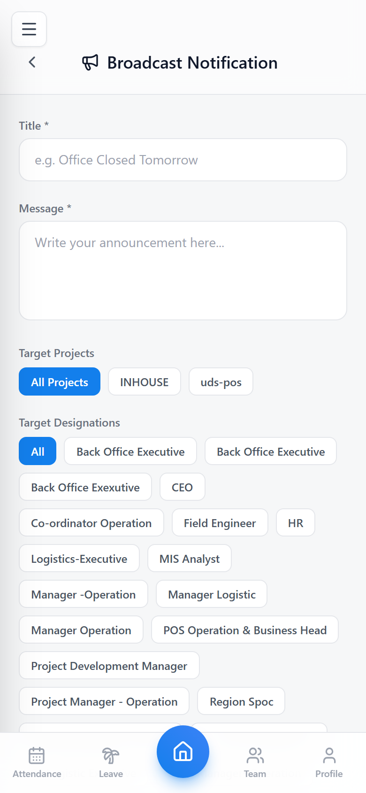

**Step-by-step:**
1. Enter a **title** for the notification.
2. Write the **message body**.
3. Select **target projects:** "All Projects" or tap specific project chips.
4. Select **target designations:** "All" or tap specific designation chips.
5. Tap **"Send Notification"**.

All matching employees receive an in-app notification immediately.

---

## 18. Master Data Management (Super Admin / HR)

**Who can access:** Super Admin, HR-designated Admins

### 18.1 Projects

**How to get here:** Organisation → Projects.

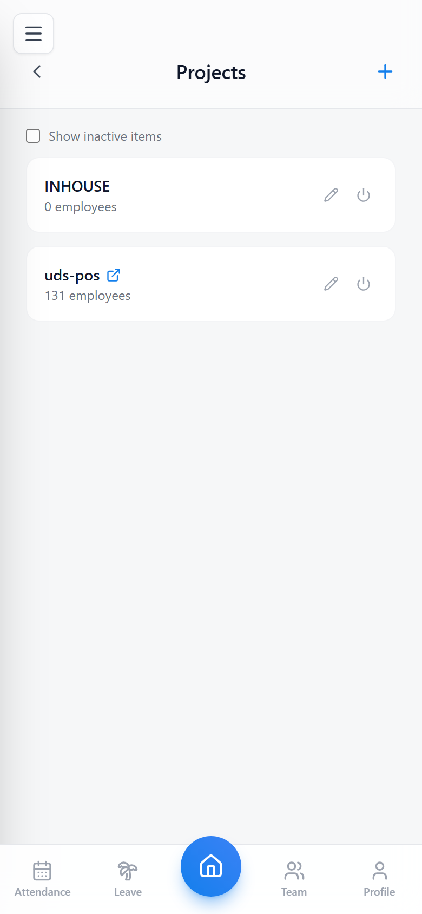

- Add new projects, edit names, set an external app URL.
- Toggle active/inactive status.

### 18.2 Departments

**How to get here:** Organisation → Departments.

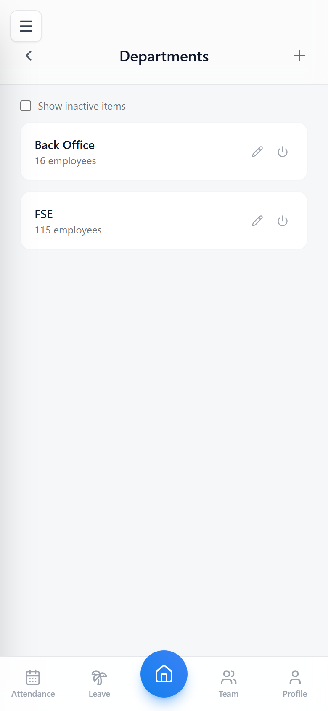

- Add new departments, edit names.
- Toggle active/inactive status.

### 18.3 Designations

**How to get here:** Organisation → Designations.

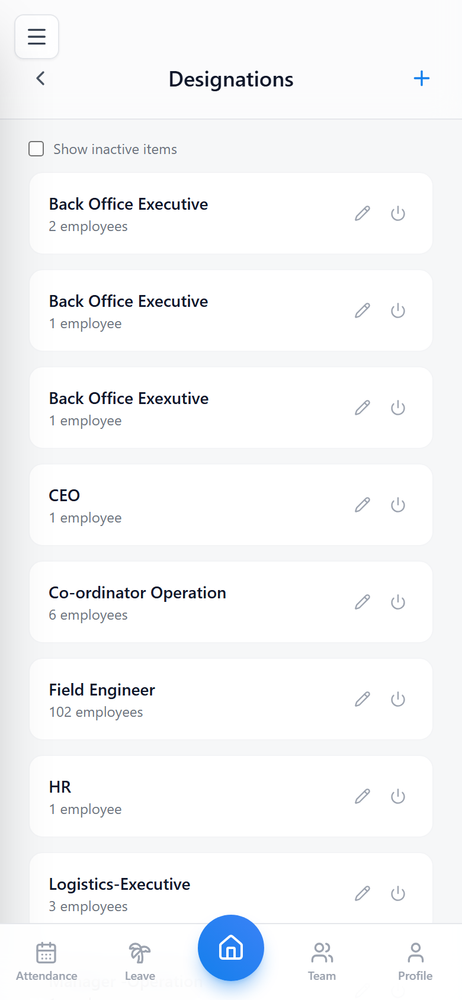

- Add new designations, edit names.
- Toggle active/inactive status.

---

## 19. Leave Policies (Super Admin / HR)

**Who can access:** Super Admin, HR-designated Admins

**How to get here:** Organisation → Leave Policies.

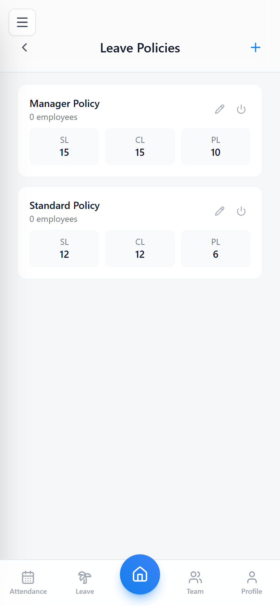

### Creating a Leave Policy

**Step-by-step:**
1. Tap **"Add Policy"**.
2. Enter a **policy name** (e.g., "Standard", "Senior Staff").
3. Set leave counts: **SL**, **CL**, **PL**.
4. Tap **"Save"**.

### Assigning a Policy

1. Go to Employee Management → Edit an employee.
2. Select the **leave policy** from the dropdown.
3. Save. The employee's leave balance is automatically updated to match the policy counts.

### Deactivating a Policy

1. Tap the **toggle** to deactivate a policy.
2. A warning shows how many employees are assigned to it.
3. Deactivated policies can't be assigned to new employees but existing assignments remain.

---

## 20. HR Inbox (Super Admin / HR)

**Who can access:** Super Admin, HR-designated Admins

**How to get here:** Organisation → HR Inbox.

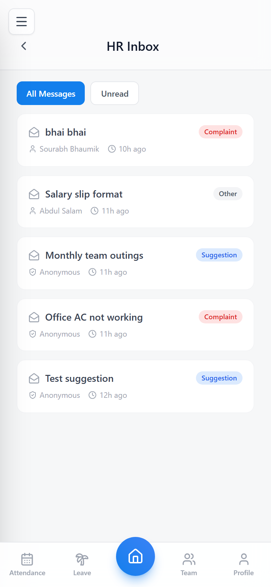

### Reading Employee Messages

**Step-by-step:**
1. The inbox shows all messages from the "Message HR" feature.
2. **Unread count** is shown in the header.
3. Filter: **"All Messages"** or **"Unread"**.
4. **Tap a message** to expand the full text.
5. Messages are auto-marked as read when expanded.
6. Each message shows: subject, category (Complaint/Suggestion/Feedback/Other), sender name or "Anonymous", and time.

---

## 21. My Projects

**How to get here:** Profile → My Projects.

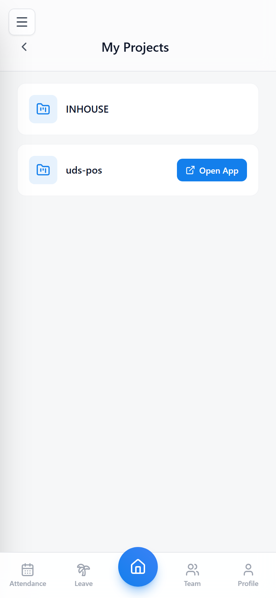

- Lists all projects you're assigned to.
- Super Admin/HR see all active projects.
- If a project has an **external app URL**, an "Open App" button appears.

---

## 22. Message HR

**How to get here:** Profile → Message HR.

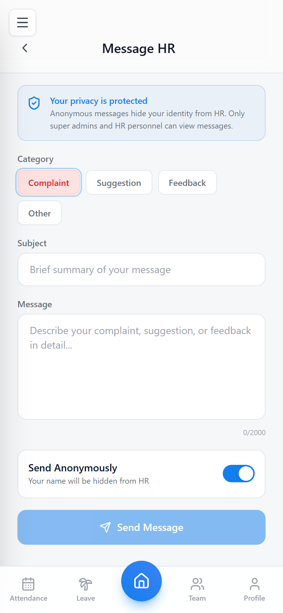

**Step-by-step:**
1. Select a **category:** Complaint, Suggestion, Feedback, or Other.
2. Enter a **subject** (max 200 characters).
3. Write your **message** (max 2000 characters).
4. The **"Send Anonymously"** toggle is ON by default. Turn it off if you want HR to see your name.
5. Tap **"Send Message"**.

Your message is delivered to the HR Inbox. If anonymous, your name is hidden.

---

## 23. Navigation

### Sidebar Menu

Tap the **hamburger menu** (three horizontal lines) at the top-left to open the sidebar:

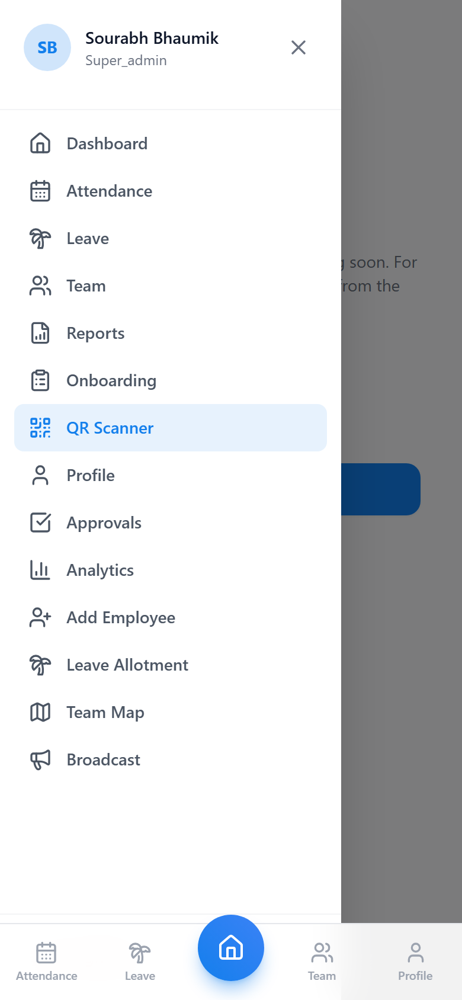

The sidebar shows links to all available pages based on your role.

### Bottom Navigation Bar

The bottom bar provides quick access to the 4 most-used pages:

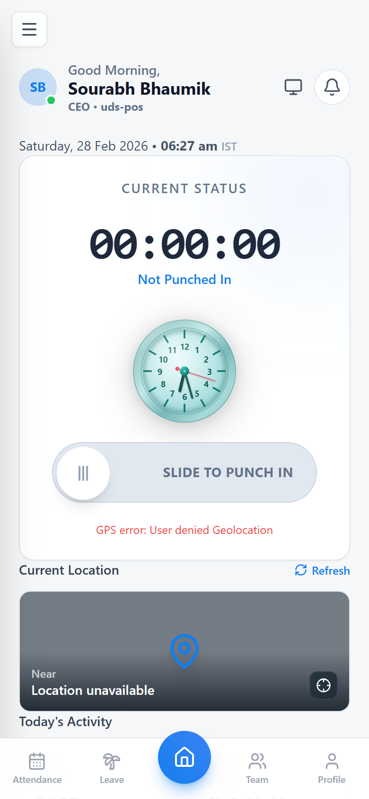

| Icon | Page |
|------|------|
| Home | Dashboard |
| Calendar | Attendance |
| Briefcase | Leave |
| User | Profile |

---

## 24. FAQ — Frequently Asked Questions

### Login & Account

**Q: What is my login email?**
A: You don't need to know your email. Just enter your **10-digit phone number** on the login screen. The system constructs the email automatically.

**Q: What is my default password?**
A: First 4 letters of your name (lowercase, no spaces) + last 4 digits of your phone number. Example: Name "Rajesh Kumar", Phone "9876543210" → password `raje3210`.

**Q: I changed my phone number. Can I still log in?**
A: Ask your admin to update your phone number in Employee Management. Your login phone number will be updated. Use the new phone + default password (or ask for a password reset).

**Q: Can I log in on two devices at the same time?**
A: No. Field Connect enforces single-device login. Logging in on a new device ends your session on the old device.

**Q: I'm getting "Invalid credentials" even though my password is correct.**
A: Your password may have been reset by an admin. Try the default password (first 4 of name + last 4 of phone). If that doesn't work, ask your admin to reset it.

### Punch & Attendance

**Q: I forgot to punch out yesterday. What happens?**
A: The system auto-closes the session at 11:59 PM IST. This shows as a full-day session with an auto-close marker. You can request a rectification to set the correct punch-out time.

**Q: I punched in but the timer isn't showing.**
A: Try refreshing the page. If you're offline, the punch may be queued — check the sync banner at the top of the dashboard.

**Q: Why does my attendance show "Half-Day" when I worked all day?**
A: The system calculates status based on total hours: 4+ hours = Present, 1-4 hours = Half-Day, less than 1 hour = Absent. If your sessions total less than 4 hours, you'll see Half-Day. Request a rectification if this is incorrect.

**Q: Can I punch in/out multiple times in one day?**
A: Yes. Each punch-in creates a new session. All sessions are tracked and their durations are summed for the daily total.

**Q: Why is my GPS location wrong?**
A: GPS accuracy depends on your phone's hardware and surroundings (indoor vs outdoor). Tap the **refresh** button on the location widget to re-capture. Being outdoors with clear sky gives the best accuracy.

### Leave

**Q: I applied for leave but it still shows "Pending." How long does approval take?**
A: It depends on your manager. They receive a notification when you apply. If it's urgent, contact your manager directly.

**Q: Can I cancel a leave request?**
A: Yes, but only if it's still "Pending." Go to Leave → scroll to Leave History → tap **"Withdraw"** on the pending request. You cannot withdraw approved or rejected leaves.

**Q: My leave balance shows 0 even though it's a new year.**
A: Your admin needs to allot leave balances for the new year. Contact your admin or HR.

**Q: Can I attach a medical certificate to my sick leave?**
A: Yes. When applying for leave, tap **"Attach File"** to upload a document (PDF, image, etc.).

### Offline & Sync

**Q: Can I use the app without internet?**
A: Partially. You can punch in/out and view cached data. Actions are queued and sync automatically when you're back online. Some features (maps, reports, analytics) need an internet connection.

**Q: I see "X items pending sync." What does this mean?**
A: You performed actions (punch, location capture) while offline. They'll sync when you're online. If items remain stuck, try refreshing the page.

**Q: An item moved to "dead letter." What does that mean?**
A: An action failed to sync after 5 attempts. This usually means there was a server-side conflict (e.g., duplicate punch-in). Contact your admin if you're missing data.

### Admin & Management

**Q: How do I give someone manager access?**
A: Go to Employee Management → find the employee → change their role dropdown to "Manager." Regular admins can assign Employee/Manager roles; only Super Admin can assign Admin/Super Admin.

**Q: A deactivated employee wants to rejoin. What do I do?**
A: Go to Employee Management → filter by "Deactivated" → find the employee → tap **"Restore."** Their account is reactivated with the same data.

**Q: How do I create an onboarding link for a new hire?**
A: Go to Organisation → Onboarding → tap "Generate Token" → copy the link → share it with the new employee. They fill in their details and the account is created automatically.

---

## 25. Common Mistakes & Troubleshooting

### Login Issues

| Problem | Cause | Solution |
|---------|-------|----------|
| "Invalid credentials" after admin reset | You're using your old password | Use the default password: first 4 of name + last 4 of phone |
| Logged out unexpectedly | Someone logged in on another device | Log in again — only one device is allowed |
| Stuck on loading screen after login | Stale session data in browser | Clear your browser cache/cookies for the site, then log in again |
| "Network error" on login | No internet or server is down | Check your internet connection. Try again in a few minutes |
| Phone number not found | Wrong number or account not created | Verify the number with your admin. They may need to add you first |

### Punch Issues

| Problem | Cause | Solution |
|---------|-------|----------|
| GPS permission denied | You blocked location access | Go to phone Settings → App Permissions → Browser → Location → Allow |
| "Already punched in" message | A previous session was not properly closed | Punch out first, then punch in again |
| Punch-in location shows wrong address | GPS inaccuracy (indoor/urban canyon) | Go outdoors and tap the refresh button. GPS works best with open sky |
| Timer not counting after punch-in | Page state desynced | Pull down to refresh the page |
| Yesterday's session auto-closed at 11:59 PM | You forgot to punch out | This is normal. Request a rectification to correct the actual punch-out time |

### Leave Issues

| Problem | Cause | Solution |
|---------|-------|----------|
| "Insufficient balance" error | Not enough leave days remaining | Check your balance card. You may need to apply for a different leave type or fewer days |
| "Overlapping leave exists" error | You already have a pending/approved leave for those dates | Check Leave History — withdraw the overlapping request first |
| Leave balance shows 0 at year start | Admin hasn't allotted leaves for the new year | Contact your admin to allot leave balances |
| File upload fails | File too large or unsupported format | Keep attachments under 10 MB. Use PDF or common image formats |
| Withdraw button missing | Leave is already approved or rejected | You can only withdraw "Pending" requests. Contact your manager for approved leaves |

### Sync Issues

| Problem | Cause | Solution |
|---------|-------|----------|
| Sync queue stuck (items not clearing) | Intermittent connectivity | Move to a location with stable internet. The queue retries automatically |
| "Dead letter" items | 5 consecutive sync failures | Data may be conflicting. Contact your admin to manually verify your records |
| Data from yesterday missing | Synced after midnight — recorded with today's date | Request a rectification for the correct date |

### Admin Issues

| Problem | Cause | Solution |
|---------|-------|----------|
| Can't see employees from other projects | You're a regular admin (project-scoped) | Only Super Admin/HR can see all projects. Contact your Super Admin if needed |
| Can't assign Admin role | You're not a Super Admin | Only Super Admins can assign Admin and Super Admin roles |
| "Repair accounts" API times out | Too many users for Vercel's timeout limit | Run the API via curl from a terminal (not the browser) |
| Onboarding link doesn't work | Token expired (7-day limit) | Generate a new token and share the new link |
| Employee can't log in after creation | Wrong phone number entered | Edit the employee to fix the phone number. Their login email updates automatically |

### Browser & PWA Issues

| Problem | Cause | Solution |
|---------|-------|----------|
| App looks broken/old | Stale service worker cache | In your browser, go to Settings → Clear Cache. Or open DevTools → Application → Service Workers → Update |
| PWA install prompt doesn't appear | Already installed, or browser doesn't support PWA | Check if it's already on your home screen. Try Chrome/Edge for best PWA support |
| Dark mode not working | Theme setting cleared | Go to Profile → Appearance → select your preferred theme |
| Maps not loading | Internet required for map tiles | Maps need internet. The Leaflet map tiles load from external servers |
| Page shows "Access Denied" | Your role doesn't have permission | This page requires a higher role. Contact your admin if you believe you should have access |
